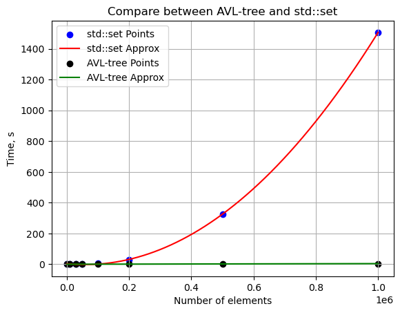

# RangeQuery
### Дисклеймер
Всем привет!
Данный проект выполнен в учебных целях в рамках курса по C++. 

Целью данного проекта является написание RangeQuery.

## Условие задачи
Со стандартного ввода поступают ключи и запросы
* Каждый запрос это пара из двух возможных ключей. Он имеет смысл если
второй больше первого иначе ответ это ноль.
* Нужно для каждого запроса подсчитать в дереве количество ключей, таких,
что все они лежат строго между его левой и правой границами
включительно.
* Вход: **k 10 k 20 q 8 31 q 6 9 k 30 k 40 q 15 40**
* Результат: **2 0 3**
* Также требуется сравнить время работы с **std::set**

## Компиляция
```
cd RangeQuery/
cmake -S ./ -B build/
cmake --build build
cd build/
```
При сборке проекта можно использовать флаги -DBUILD_TESTING и -DCMAKE_BUILD_TYPE.

Для запуска проекта требуется:

```
./build/tree < path_to_data_file
```

Для запуска тестов требуется:
```
cd build/
ctest
```

Для запуска сравнения времени требуется:
```
./build/compare/compare < input_file
```

## Результаты
В результате мы получили более эффективный код, нежели с использованием стандартного контейнера.

На графиках представленных ниже это можно явно пронаблюдать.



График для нашего дерева практически совпадает с абсциссой, поэтому рассмотрим графики поотдельности.


